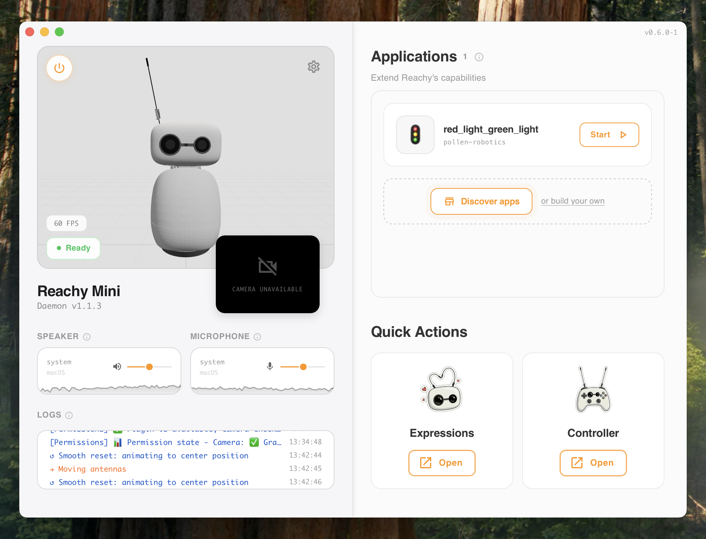

<div align="center">
  <a href="https://huggingface.co/spaces?q=reachy_mini">
    
  </a>
  
  <h1>Reachy Mini Control</h1>
  
  <p>
    
    
    
    
  </p>
</div>

A modern desktop application for controlling and monitoring your Reachy Mini robot. Built with Tauri and React for a native, performant experience.

The Reachy Mini Control application serves as the primary interface between users and their Reachy Mini robot hardware. Unlike command-line tools or web-based interfaces, this desktop app provides a persistent, native experience that manages the robot's daemon lifecycle, handles USB detection and connection management, and offers a unified dashboard for all robot interactions. The application wraps the FastAPI-based daemon that runs on the robot, providing a user-friendly layer over the underlying REST API and Python SDK.

At its core, the app manages the daemon process—starting it when a robot is detected, monitoring its health, and gracefully shutting it down when needed. The 3D visualization engine renders the robot's current state in real-time, showing joint positions, orientations, and overall pose. This visualization isn't just cosmetic; it provides immediate feedback for debugging movements, understanding the robot's current configuration, and verifying that commands are being executed correctly.

The integrated application store connects users to a growing ecosystem of Reachy Mini apps hosted on Hugging Face Spaces. Apps tagged with `reachy_mini` are automatically discoverable, and the app handles the entire lifecycle: installation via pip in isolated environments, execution through the daemon's app management API, and cleanup when apps are removed. This transforms the robot from a standalone device into a platform where developers can share and users can easily discover new capabilities.

Beyond app management, the interface provides direct access to core robot features like audio I/O (with real-time visualization of speaker output and microphone input), camera feed display, and quick access to built-in choreographies and control interfaces. The simulation mode allows developers to work without physical hardware, using MuJoCo physics simulation that automatically installs and configures itself when needed.

The application is built on Tauri 2.0, which provides a lightweight alternative to Electron by using the system's native webview instead of bundling Chromium. The Rust backend handles system-level operations like USB detection, process management, and file system access, while the React frontend provides a responsive, Material-UI-based interface. This architecture ensures low resource usage, fast startup times, and native performance for operations like window management and system integration.



## ✨ Features

- 🤖 **Robot Control** - Start, stop, and monitor your Reachy Mini daemon
- 📊 **Real-time Monitoring** - Live 3D visualization of robot state
- 🏪 **Application Store** - Discover, install, and manage apps from Hugging Face Spaces
  - Browse official and community apps
  - Search and filter by categories
  - One-click installation and removal
  - Start and stop apps directly from the interface
- 📚 **Create Your Own Apps** - Tutorials and guides to build custom applications
  - Learn how to interact with the daemon API
  - Build apps with the Python SDK
  - Deploy and share on Hugging Face Spaces
- 🔄 **Auto Updates** - Seamless automatic updates with progress tracking
- 🎨 **Modern UI** - Clean, intuitive interface built with Material-UI
  - Dark mode support
  - Responsive design
- 🔌 **USB Detection** - Automatic detection of Reachy Mini via USB
- 🎭 **Simulation Mode** - Test and develop without hardware using MuJoCo simulation
- 📱 **Cross-platform** - Works on macOS, Windows, and Linux

## 🚀 Quick Start

### Prerequisites

- **Node.js 24.4.0+** (LTS recommended) and Yarn
  - If using `nvm`: `nvm install --lts && nvm use --lts`
- Rust (latest stable)
- System dependencies for Tauri ([see Tauri docs](https://v2.tauri.app/start/prerequisites/))

### Installation

```bash
# Clone the repository
git clone https://github.com/pollen-robotics/reachy-mini-desktop-app.git
cd reachy-mini-desktop-app/tauri-app

# Install dependencies
yarn install

# Run in development mode
yarn tauri:devc
```

```bash
# Check your Node version
node --version

# If using nvm, install and use the latest LTS
nvm install --lts
nvm use --lts
nvm alias default $(nvm version)  # Set as default
```

### Building

**Important**: You must build the sidecar before building the application.

```bash
# 1. Build the sidecar (required first step)
yarn build:sidecar-macos    # macOS
yarn build:sidecar-linux    # Linux
yarn build:sidecar-windows  # Windows

# 2. Build the application
yarn tauri:build            # Build for production (uses PyPI release by default)

# Build for specific platform
yarn tauri build --target aarch64-apple-darwin
yarn tauri build --target x86_64-apple-darwin
yarn tauri build --target x86_64-pc-windows-msvc
yarn tauri build --target x86_64-unknown-linux-gnu
```

#### Installing the daemon from different sources

By default, the `reachy-mini` package is installed from PyPI (latest stable release). You can also install from any GitHub branch by using the `REACHY_MINI_SOURCE` environment variable:

- **PyPI (default)** : `REACHY_MINI_SOURCE=pypi` or omit the variable
- **GitHub branch** : `REACHY_MINI_SOURCE=<branch-name>` (e.g., `develop`, `main`, `feature/xyz`)

Examples to build the sidecar with different sources:
```bash
# Build with develop branch
REACHY_MINI_SOURCE=develop bash ./scripts/build/build-sidecar-unix.sh

# Build with main branch
REACHY_MINI_SOURCE=main bash ./scripts/build/build-sidecar-unix.sh

# Build with any other branch
REACHY_MINI_SOURCE=feature/my-feature bash ./scripts/build/build-sidecar-unix.sh
```

## 📖 Documentation

- [Project Conventions](./CONVENTIONS.md) - Coding standards, naming conventions, and project structure
- [Build Process](./RAPPORT_BUILD.md) - Detailed documentation of the build process, sidecar, signing, and CI/CD
- [Release Files](./RELEASE_FILES.md) - Documentation of all release-related files and their roles
- [Scripts Directory](./scripts/README.md) - Organization and usage of build scripts
- [Update Pipelines](./docs/UPDATE_PIPELINES.md) - Dev and production update workflows
- [Testing Guide](./docs/TESTING_GUIDE.md) - How to test the application
- [Architecture](./docs/STATE_MACHINE.md) - Application state machine and architecture

### Application Store

The application includes a built-in store for discovering and installing apps:

- **Discover Apps**: Browse apps from Hugging Face Spaces tagged with `reachy_mini`
- **Install & Manage**: Install, uninstall, start, and stop apps with a simple interface
- **Search & Filter**: Find apps by name or filter by categories
- **Create Apps**: Access tutorials to learn how to build your own Reachy Mini applications

Apps are managed through the FastAPI daemon API, which handles installation and execution.

## 🛠️ Development

### Available Scripts

**Development:**
```bash
yarn dev                    # Start Vite dev server
yarn tauri:dev              # Run Tauri app in dev mode
yarn tauri:dev:sim          # Run Tauri app in simulation mode (skip USB detection)
```

**Building:**
```bash
yarn build:sidecar-macos    # Build sidecar for macOS (PyPI)
yarn build:sidecar-linux    # Build sidecar for Linux (PyPI)
yarn build:sidecar-windows  # Build sidecar for Windows (PyPI)
yarn build:sidecar-macos:develop    # Build sidecar with GitHub develop branch (macOS)
yarn build:sidecar-linux:develop    # Build sidecar with GitHub develop branch (Linux)
yarn build:sidecar-windows:develop  # Build sidecar with GitHub develop branch (Windows)
yarn tauri:build            # Build production bundle (requires sidecar built first)
```

**Updates:**
```bash
yarn build:update:dev       # Build update files for local testing
yarn build:update:prod      # Build update files for production
yarn serve:updates          # Serve updates locally for testing
```

**Testing:**
```bash
yarn test:sidecar          # Test the sidecar build
yarn test:app              # Test the complete application
yarn test:updater          # Test the update system
yarn test:update-prod      # Test production updates
yarn test:all              # Run all tests
```

**Daemon Management:**
```bash
yarn check-daemon          # Check daemon status and health
yarn kill-daemon           # Stop all running daemon processes
```

**macOS Permissions (Development):**
```bash
yarn reset-permissions     # Reset Camera and Microphone permissions for testing
```
Note: 
- Dev mode uses strict permission checking (same as production): only Authorized (3) = granted
- Use `yarn reset-permissions` to test the permission flow
- You may need to run `yarn reset-permissions` with `sudo` if you get permission errors

### 🎭 Simulation Mode

To develop or test the application without a USB-connected robot, use simulation mode:

```bash
# Via npm/yarn script (recommended)
yarn tauri:dev:sim

# Or manually with environment variable
VITE_SIM_MODE=true yarn tauri:dev

# Or via localStorage (in browser console)
localStorage.setItem('simMode', 'true')
# Then reload the application
```

**Simulation mode behavior:**
- ✅ Skip USB detection (goes directly to `ReadyToStartView`)
- ✅ Simulates a USB connection (`/dev/tty.usbserial-SIMULATED`)
- ✅ Visual indicator "🎭 SIM" in the top bar
- ✅ **The daemon automatically starts in simulation mode (MuJoCo)** with the `--sim` argument
- ✅ **MuJoCo is automatically installed** on first startup in simulation mode
  - Installation happens in the background via `uv pip install reachy-mini[mujoco]`
  - If MuJoCo is already installed, installation will be quick (verification only)
- 🍎 **On macOS**: Automatically uses `mjpython` (required by MuJoCo) with automatic shebang correction

**Disable simulation mode:**
```bash
# Remove the environment variable
yarn tauri:dev

# Or via localStorage
localStorage.removeItem('simMode')
```

### Project Structure

```
tauri-app/
├── src/                              # Frontend React code
│   ├── components/                   # Reusable React components
│   │   └── viewer3d/                # 3D robot visualization
│   ├── hooks/                        # Custom React hooks (organized by category)
│   │   ├── apps/                    # Application-related hooks
│   │   ├── daemon/                  # Daemon-related hooks
│   │   ├── robot/                   # Robot-related hooks
│   │   └── system/                  # System hooks (updates, USB, logs, window)
│   ├── views/                        # Main application views
│   │   ├── update/                  # Update view
│   │   ├── robot-not-detected/      # USB detection view
│   │   ├── ready-to-start/          # Ready to start view
│   │   ├── starting/                # Daemon startup view
│   │   ├── transition/              # Transition view
│   │   ├── closing/                 # Closing view
│   │   └── active-robot/             # Active robot view
│   │       ├── application-store/    # Application store UI
│   │       ├── audio/                # Audio controls
│   │       └── camera/               # Camera feed
│   ├── store/                        # State management (Zustand)
│   ├── utils/                        # Utility functions
│   │   └── viewer3d/                # 3D-specific utilities
│   ├── config/                       # Centralized configuration
│   └── constants/                    # Shared constants
├── src-tauri/                        # Rust backend
│   ├── src/                          # Rust source code
│   ├── tauri.conf.json               # Tauri configuration
│   └── capabilities/                 # Tauri security capabilities
├── scripts/                          # Build and utility scripts (organized by category)
│   ├── build/                        # Build scripts (sidecar, updates)
│   ├── signing/                      # Code signing scripts (macOS)
│   ├── test/                         # Test scripts
│   ├── daemon/                       # Daemon management scripts
│   └── utils/                        # Utility scripts
├── uv-wrapper/                       # UV wrapper for Python package management
├── CONVENTIONS.md                    # Project conventions and coding standards
├── RAPPORT_BUILD.md                  # Detailed build process documentation
├── RELEASE_FILES.md                  # Release files and their roles
└── docs/                             # Additional documentation
```

**Key Architecture Points:**
- **Hooks** are organized by domain (apps, daemon, robot, system) for better maintainability
- **Views** are organized in dedicated folders with their associated components
- **Utils** are centralized with domain-specific utilities in subfolders (e.g., `viewer3d/`)
- **Config** centralizes all configuration constants (timeouts, intervals, etc.)
- See [CONVENTIONS.md](./CONVENTIONS.md) for detailed coding standards and conventions

## 🔄 Updates

The application includes automatic update functionality:

- **Automatic Updates**: Checks for updates on startup and periodically (every hour)
- **Development**: Test updates locally with `yarn build:update:dev` and `yarn serve:updates`
- **Production**: Updates are automatically built, signed, and deployed to GitHub Pages via GitHub Actions
- **Update Endpoint**: `https://pollen-robotics.github.io/reachy-mini-desktop-app/latest.json`

See [UPDATE_PIPELINES.md](./docs/UPDATE_PIPELINES.md) for detailed information.

## 🤝 Contributing

Contributions are welcome! Please feel free to submit a Pull Request.

1. Fork the repository
2. Create your feature branch (`git checkout -b feature/amazing-feature`)
3. Commit your changes (`git commit -m 'Add some amazing feature'`)
4. Push to the branch (`git push origin feature/amazing-feature`)
5. Open a Pull Request

## 📝 License

This project is licensed under the MIT License - see the LICENSE file for details.

## 🙏 Acknowledgments

- [Tauri](https://tauri.app/) - Framework for building desktop apps
- [React](https://react.dev/) - UI library
- [Material-UI](https://mui.com/) - Component library
- [Reachy Mini](https://www.pollen-robotics.com/reachy-mini/) - The robot this app controls

---

Made with ❤️ for the Reachy Mini community
